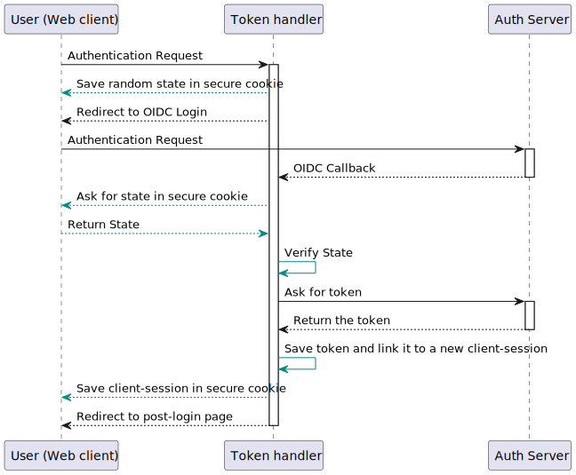

token-handler
-------------------------------

# Considerations

This project is born because I was curious on how to use the Backend For Frontend pattern to avoid the OIDC login from a
frontend application.

The downside of using the client for the login to an OIDC auth server is that we need to store the tokens on the
browser, where an attacker could easily try and stole it.

This backend service implements the token-handler pattern to handle the login to the OIDC auth server, and then to store
the tokens on internally on a database. The frontend web application will only receive a secure http-only session token,
that will be linked to the tokens in the database.

The service also provides a proxy service for all the other backend services that the web application needs to reach.
When the web client needs to send a request to a specific backend service, it will call the corresponding proxy endpoint
on the token-handler. Then the token-handler will use the session cookie to get the OIDC access-token and inject it into
the request headers.

The token-handler will take care of maintain the access-tokens valid by renewing them, and also to maintain the database
storage by cleaning the expired sessions.

## Ensure the session cookie is secure

1) Use HTTPS to encrypt the communication between the client application and the server. This ensures that the access 
   token is transmitted securely over the network and cannot be intercepted by third parties.
2) Set the Secure flag on the cookie, which ensures that the cookie is only transmitted over HTTPS. This prevents the
   cookie from being transmitted over an insecure HTTP connection.
3) Set the HttpOnly flag on the cookie, which ensures that the cookie cannot be accessed by client-side scripts, such as
   JavaScript. This helps to prevent cross-site scripting (XSS) attacks, where an attacker injects malicious scripts
   into a web page and steals the user's access token.
4) Set a short expiration time for the cookie. This ensures that the cookie will only be valid for a limited time,
   educing the risk of the access token being compromised if the cookie is stolen.

# Workflows

## Login workflow

## Access to a secured resource using the proxy

# Configuration

The `token-handler` sefvices can be configured using command line parameters, or environment variables, here follows the
list of accepted parameters:

| Command line                    | Environment variable          | Description                                                                                |
|---------------------------------|-------------------------------|--------------------------------------------------------------------------------------------|
| --cookie_domain                 | COOKIE_DOMAIN                 | the domain for the session cookie (default "localhost")                                    |
| --cookie_name                   | COOKIE_NAME                   | the name of the session cookie (default "session")                                         |
| --db_host                       | DB_HOST                       | the database server hostname or ip address                                                 |
| --db_name                       | DB_HOST                       | the database name                                                                          |
| --db_password                   | DB_PASSWORD                   | the password to use to connect the database                                                |
| --db_type                       | DB_TYPE                       | the database backend used (postgresql, sqlite) (default "sqlite")                          |
| --db_username                   | DB_USERNAME                   | the username to use to connect the database                                                |
| --is_production                 | IS_PRODUCTION                 | if set, configures `token-handler` for a production environment                            |
| --listen_addr                   | LISTEN_ADDR                   | define the address where `token-handler` will listen on (default ":9080")                  |
| --log_level                     | LOG_LEVEL                     | set the logging level (default info)                                                       |
| --oidc_client_id                | OIDC_CLIENT_ID                | the oidc auth server client-id                                                             |
| --oidc_client_secret            | OIDC_CLIENT_SECRET            | the oidc auth server client-secret                                                         |
| --oidc_issuer                   | OIDC_ISSUER                   | the url of the oidc auth server issuer                                                     |
| --oidc_post_login_redirect_url  | OIDC_POST_LOGIN_REDIRECT_URL  | where to redirect the client after a valid login                                           |
| --oidc_post_logout_redirect_url | OIDC_POST_LOGOUT_REDIRECT_URL | where to redirect the client after a logout                                                |
| --oidc_redirect_url             | OIDC_REDIRECT_URL             | the endpoint where to mount the oidc auth callback                                         |
| --proxy_config                  | PROXY_CONFIG                  | the path to the proxy configuration file                                                   |
| --session_auth_secret           | SESSION_AUTH_SECRET           | the authentication key for the session cookie (default "my-secret-key-CHANGE-ME-IN-PROD!") |
| --session_db_key                | SESSION_DB_KEY                | the encryption key for the session db storage                                              |
| --session_enc_secret            | SESSION_ENC_SECRET            | the encryption key for the session cookie                                                  |
| --session_old_auth_secret       | SESSION_OLD_AUTH_SECRET       | the old authentication key for the session cookie, used for the secret rotation            |
| --session_old_db_key            | SESSION_DB_KEY                | the old encryption key for the session db storage, used for the secret rotation            |
| --session_old_enc_secret        | SESSION_OLD_ENC_SECRET        | the old encryption key for the session cookie, used for the secret rotation                |

> **Note**: to ensure the security of the session cookie, you **MUST** specify a value for `SESSION_AUTH_SECRET`, the
> default value is NOT secure!
